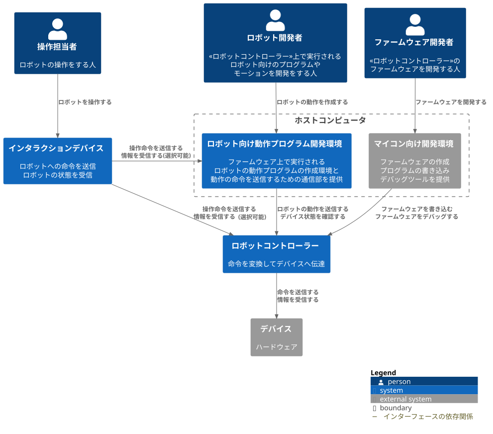
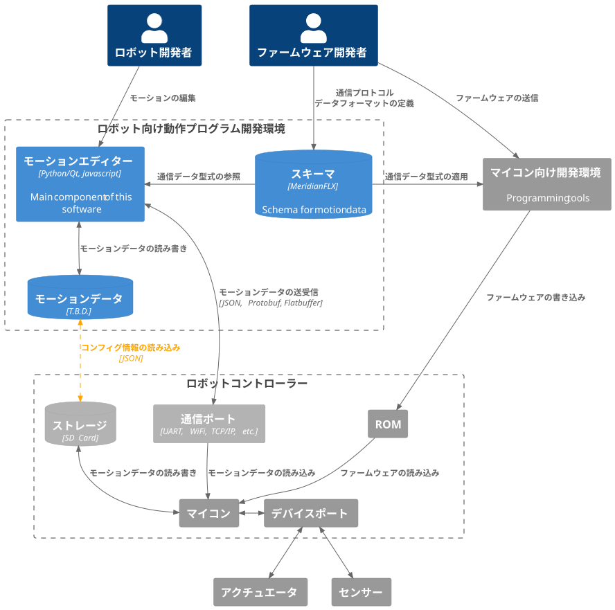
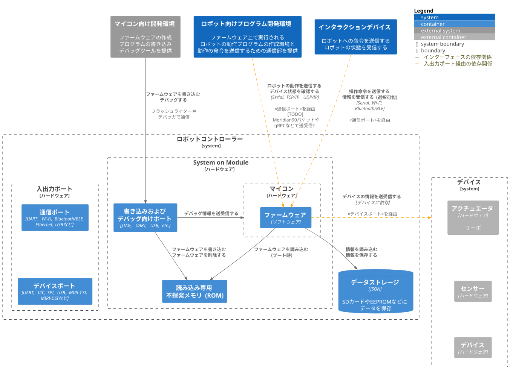
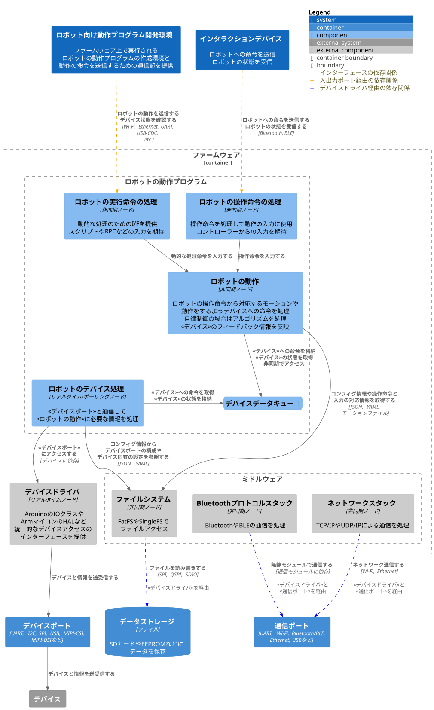
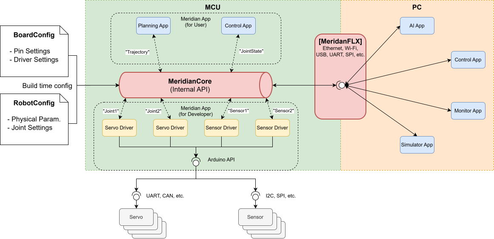

MeridianFLX Design
===

MeridianFLXの設計について記載します。
現在は検討中の段階であり、記載内容は継続的な変更を前提とします。

参考:

- [要求分析](./RequirementAnalysis.md)
- [ハードウェア仕様](./FormFactorSpecification.md)

## システムアーキテクチャ

今回は[C4モデル](https://ja.wikipedia.org/wiki/C4%E3%83%A2%E3%83%87%E3%83%AB)をベースに設計し、最終的なアーキテクチャを決定します。

### システムコンテキスト

MeridianFlowを実現する抽象的なシステム構成とユーザーの関係性は以下

### コンテナ

"ロボット向け動作プログラム開発環境"と"ロボットコントローラー"について、コンテナレベルでの関係性は以下

図. ロボット向け動作プログラム開発環境

図. ロボットコントローラー

### コンポーネント

"ロボットコントローラー"内に存在するマイコンの”ファームウェア" に対する、より詳細なコンポーネントレベルでの構成は以下

## ファームウェアアーキテクチャ

"ファームウェア" についてはC4モデルとは別に詳細な内容も検討中である。

