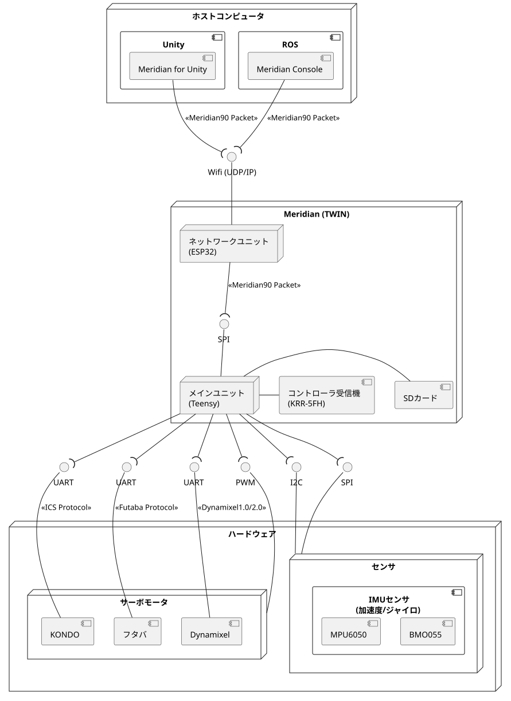

## About

このドキュメントではMeridian計画の要求について定義し、個々にどんな機能が必要であるかを分析します。
要求は以下のドキュメントをインプットとします。

1. ロボットの気のめぐりをよくする計画 [^1]
2. Meridianの中間まとめ [^2]
3. マインドマップ [^3]

[^1]: [ロボットの気のめぐりをよくする計画](https://note.com/ninagawa123/n/nf9dc2a7c998d)
[^2]: [Meridianの中間まとめ](https://note.com/ninagawa123/n/ncfde7a6fc835)
[^3]: [Meridian Project (miro.com)](https://miro.com/app/board/uXjVOn306bI=/)

## Wordlist

XXX

## Requierment

Meridianでは、ロボットの作成時に解決の難しい点を考慮し、これらを解決する統合的な開発・動作環境を提供するプロジェクトです。
本節ではMeridianにおける要求について、ブログ記事[^1]などから抜粋して整理します。

### Problem

ホビーロボットや小型ロボットの作成にあたり、以下のような障壁が考えられます。

- パーツの選定
  - ハードウェア・ソフトウェアにさまざまな種類があり、制約の元に組み合わせを考えたとき選定が難しい
  - パーツ同士のコネクタや通信方式にも様々な規格があり、メーカーを揃えて使うなどの工夫が必要
  - サーボモータのコマンドについては各社さまざまな通信規格を採用しており、混在させることが難しい
- ソフトウェア
  - オープンソースのロボット開発ソリューションは、起動時間や空間的な観点で小型のホビーロボット開発に不向き
  - モーション作成ソフトとシミュレーターがリンクしていない
- ROS環境
  - ROSのリソースは多くのマイコンにとって扱うことが容易ではない
  - ロボットの動作をシーケンスとして実行したいケースもあり、そのためだけにROS環境を入れるのは冗長

### Concept

上記の問題を解決するために、Meridianでは以下のコンセプトを念頭において開発を進めます。

- ロボット制作の初級者でも理解できる簡便さ
- 機能を最小限にとどめた軽量さと拡張性
- パーツのメーカーを選ばない高い自由度
- 各自の環境に依存しない疎結合なシステム構成

### Achivement

上記の問題を解決するため、Meridianで達成すべき要求事項として以下を検討しています。

- ロボットは開発環境のコンピュータから、ロボットに搭載されたマイコンボードにより各サーボへの指令を送信し、また情報を収集する
- ロボットに搭載されたマイコンの電源がONになってから、動作可能になるまでのタイムラグを少なくする
- 複数メーカーのホビーロボット向けサーボが、統一的なインターフェースによって扱える
- コマ送りモーションの再生によるロボットへの動作指示と、計算によるロボットの制御の両方が同一のフレームワーク上で扱える
- コマ送りモーションを基準にして、計算によるロボットの制御によりサーボへの指令値が補正できるようにする
- 制御周期は標準で2ms、最長でも10msで各サーボに指令が出せることを保証する
- 開発時に使用するホストコンピュータのOSは、Windows、Mac、Linux環境を想定する
- コマ送りモーションの再生は、上記ホストコンピュータに加え、iOSやAndroidによるスマートフォン、タブレット端末を想定する
- ロボットの開発環境上で、3Dモデルによりロボットの形状および姿勢をビジュアライズして表示できる
- 実環境のロボットの姿勢情報について収集し、開発環境上の3Dモデルにフィードバックして表示する
- ロボットの形状およびサーボ（アクチュエータ）の構成について、統一的に定義できるフォーマットが利用できる
- VR空間上でもロボットの3Dモデルを扱うことができ、実環境におけるロボットの位置および姿勢情報をVR環境上のモデルにフィードバックできる
- ロボットの動作について、シミュレータを用いて検証することができる
- 開発できる開発送信するパケットは、各メーカのプロトコルがそれぞれ送信可能な情報を網羅できるよう策定する
- ROSなどの代表的なロボット向けミドルウェアと連動し、マイコンに対して指示が送信できる環境を提供する

### Current Implementation

上記の要件を踏まえた実装例を以下の配置図に示します。
なお開発進行中の項目が多いため、個別の開発項目はマインドマップ[^3]を参照してください。

## Breakdown

この章では、上記要件に対して現状の開発内容も考慮しながら、Meridianのあるべき構成について検討します。

### Component

ハードウェアおよびソフトウェアにおいて、どのレイヤーで何を実装すべきであるかについて、各コンポーネント単位に分解して、構成項目を整理します。

### Data Flow

システム全体の中でデータに着目して分析しなおします。

### Revise Plan

1. クロスプラットフォーム向けライブラリとIDLの利用
    アプリケーションに合わせてライブラリを構築するのは、開発効率と保守性の面で望ましくない
    ライブラリはクロスプラットフォーム向けに展開されているものを利用し、パケットはIDLで記述しで移植性を上げる。
2. ホストコンピュータからの接続インターフェースの規定
    WifiだけでなくBluetoothやEthernet、USBなどもサポートできるとよい。
    通信においてはミドルウェアやライブラリを利用し、既存の資産でスタックできることが望ましい

---

## Protocol

以下の要件を守りたい

* 組み込みデバイスでも利用可能な通信層を利用すること。特にシリアルポートのサポートは必須。
    * ただしクライアント・サーバーモデルの場合、マイコン上で動くプログラムはクライアント側の実装だけでもよい
* PC上のアプリケーション向けに複数言語にAPIが対応していること。とりわけPythonのサポートが望ましい。
* スマートフォンでも移植可能なフレームワークを採用すること。

P2Pの通信でいい場合は、シリアルポートを開いて直接シリアライズされたメッセージを流せばよい。
PC上のアプリケーションからはgRPCのような統一的なインターフェースを叩きたい要望がある。
-> Protocol Bufferをスルーして渡せる内部サーバーを経由すればよい？
